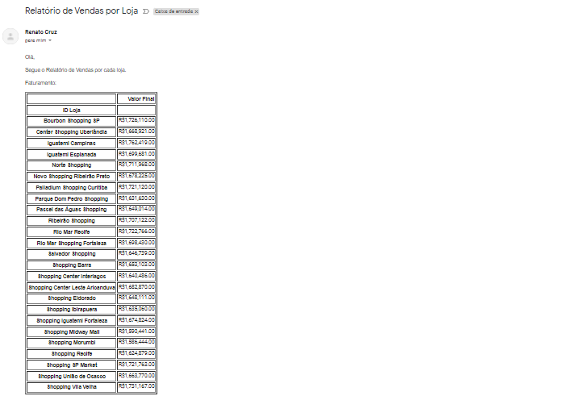
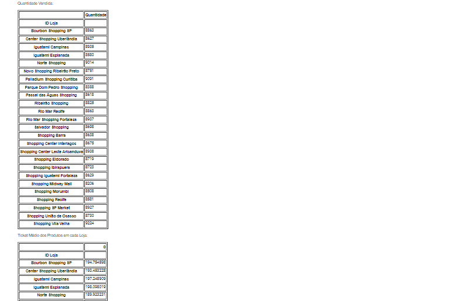
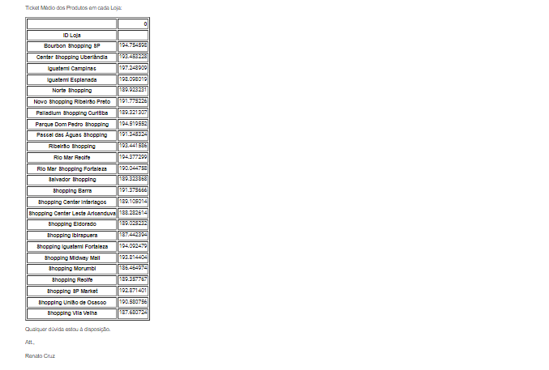
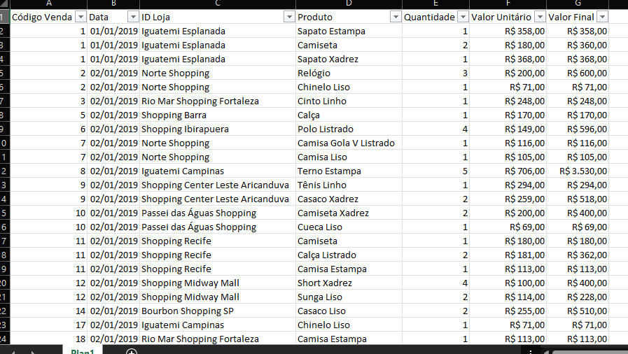

# ProjetoRelatorioVendas
Projeto de uma aplicação em Python que extrai os dados de uma tabela do Excel e permite o envio para o email, desenvolvido em Python com utilização da biblioteca Pandas e a PyWin32.

## 📷 Imagens

<kbd>
  
</kbd>

<kbd>
  
</kbd>

<kbd>
  
</kbd>

<kbd>
  
</kbd>
